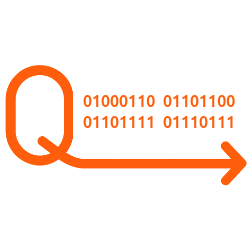

<div align="center">
    
</div>

# Laravel Queue Flow

A [Laravel Queue](https://laravel.com/docs/12.x/queues) wrapper system, simplifying queue management without creating separate Job classes.

## Features

- 🚀 **Simple API**: No need to create separate Job classes
- 🔒 **Type-safe**: Full PHP 8.2+ type hints
- 🎯 **Fluent Interface**: Chain methods for easy configuration
- 🔐 **Encryption Support**: Built-in job encryption
- 🔄 **Unique Jobs**: Prevent duplicate job execution
- ⚡ **Rate Limiting**: Control job execution rate
- 🎨 **Flexible**: Support for delays, connections, and queues

## Requirements

- PHP 8.2 or higher
- Laravel 11.0 or higher

## Installation

Install the package via Composer:

```bash
composer require b7s/laravel-queue-flow
```

The service provider will be automatically registered.

### Publish Configuration (Optional)

```bash
php artisan vendor:publish --tag=queue-flow-config
```

This package has some configurations, but it doesn't override the default Laravel settings, which you can modify in `config/queue.php`.

## Usage

### Basic Usage (using global helper function)

```php
<?php

use B7s\QueueFlow\Queue;

class TestQueueController
{
    public function doSomething(): void
    {
        // Dispatch automatically One item
        qflow(fn () => $this->doOtherThing());

        // Dispatch automatically multiple items with array of closures
        qflow([
            fn () => $this->doOtherThing(),
            fn () => $this->doMoreThings(),
            // ...
        ]);

        // Dispatch manually (set autoDispatch to false) after configuration
        qflow(fn () => $this->doOtherThing(), autoDispatch: false)
            ->onQueue('high-priority')
            ->shouldBeUnique()
            ->shouldBeEncrypted()
            ->rateLimited('default')
            ->onFailure(function () {
                // Your logic here
            })
            ->dispatch();

        // Dispatch multiple items with array of closures and apply middleware to each dispatch
        qflow([
           fn () => $this->callExternalApi(),
           fn () => $this->callExternalApi(),
        ])
        // Apply middleware to each dispatch
        ->each(fn ($dispatch) => $dispatch->through([new \Illuminate\Queue\Middleware\RateLimited('api-calls')]));
    }

    private function doOtherThing(): void
    {
        // Your logic here
    }

    private function doMoreThings(): void
    {
        // Your logic here
    }
}
```

### Auto-dispatch on Destruction

The queue will automatically dispatch when the object is destroyed if a callback was added:

> Know more about the `dispatch()` return value [here](docs/DISPATCH_RETURN.md).

Using the `Queue` instance directly:

```php
<?php

use B7s\QueueFlow\Queue;

class TestQueueController
{
    private Queue $myQueue;

    public function __construct()
    {
        $this->myQueue = new Queue();
    }

    public function doSomething(): void
    {
        // Will auto-dispatch when $this->myQueue goes out of scope
        $this->myQueue->add(fn () => $this->doOtherThing());
    }
}
```

### Delayed Jobs

```php
$queue = new Queue();
$queue
    ->add(fn () => doSomething())
    ->delay(now()->addMinutes(10))
    ->dispatch();
```

### Dependency Injection

Resolve the queue via Laravel's container and keep your classes clean:

```php
use B7s\QueueFlow\Queue;

class ReportService
{
    public function __construct(
        private readonly Queue $queue,
    ) {
    }

    public function generate(): void
    {
        $this->queue
            ->add(fn () => $this->buildReport())
            ->dispatch();
    }
}
```

You can pass an array of closures to `add()` to add multiple jobs:

```php
$queue = new Queue();

$queue
    ->add([
        fn () => doSomething(),
        fn () => doSomethingElse(),
    ])
    ->dispatch();
```

### Helper Function

Use the global `qflow()` helper to configure jobs inline.

> Jobs dispatch automatically by default
> 
> You can change this behavior in the config file `auto_dispatch_on_queue_flow_helper` or by setting the .env variable `QUEUE_FLOW_AUTO_DISPATCH_ON_HELPER` to `false`:

```php
qflow(fn () => $this->sendEmail());
```

Disable auto-dispatch when you need more control:

```php
$queue = qflow(fn () => $this->sendEmail(), autoDispatch: false);

// Configure other options before dispatching manually
$queue
    ->onQueue('emails')
    ->shouldBeUnique()
    ->dispatch();
```

### Without Relations

Prevent Eloquent model relations from being serialized:

```php
$this->myQueue
    ->add(fn () => $this->processUserData($user))
    ->withoutRelations()
    ->dispatch();
```

### Unique Jobs

Ensure a job is only queued once:

```php
// Unique for 1 hour (default)
$this->myQueue
    ->add(fn () => $this->generateReport())
    ->shouldBeUnique()
    ->dispatch();

// Unique for custom duration (in seconds)
$this->myQueue
    ->add(fn () => $this->generateReport())
    ->shouldBeUnique(7200) // 2 hours
    ->dispatch();
```

### Unique Until Processing

Job is unique only until it starts processing:

```php
$this->myQueue
    ->add(fn () => $this->processData())
    ->shouldBeUniqueUntilProcessing()
    ->dispatch();
```

### Encrypted Jobs

Encrypt the job payload:

```php
$this->myQueue
    ->add(fn () => $this->processSensitiveData())
    ->shouldBeEncrypted()
    ->onFailure(function (\Throwable $exception) {
        // Log error, send notification, etc.
        \Log::error('Payment processing failed', [
            'error' => $exception->getMessage(),
        ]);
    })
    ->dispatch();
```

### Failure Handling

Execute a callback when a job fails:

```php
$this->myQueue
    ->add(fn () => $this->processPayment($order))
    ->onFailure(function (\Throwable $exception) {
        // Log error, send notification, etc.
        \Log::error('Payment processing failed', [
            'error' => $exception->getMessage(),
            'order_id' => $order->id,
        ]);
    })
    ->dispatch();
```

The failure callback receives the exception that caused the job to fail, allowing you to:
- Log detailed error information
- Send notifications to administrators
- Update database records
- Trigger compensating actions

### Rate Limiting

Apply rate limiting to jobs:

```php
$this->myQueue
    ->add(fn () => $this->callExternalApi())
    ->rateLimited('api-calls')
    ->dispatch();
```

Configure rate limiters in `config/queue-flow.php`:

```php
'rate_limiters' => [
    'api-calls' => [
        'limit' => 60,
        'per_minute' => 1,
    ],
],
```

### Custom Queue and Connection

```php
$this->myQueue
    ->add(fn () => $this->processHeavyTask())
    ->onQueue('heavy-tasks')
    ->onConnection('redis')
    ->dispatch();
```

### Chaining Multiple Options

The methods follow the same pattern and the same naming convention as Laravel (see [Laravel Documentation](https://laravel.com/docs/12.x/queues)).

```php
$this->myQueue
    ->add(fn () => $this->complexTask())
    ->delay(now()->addMinutes(10))
    ->withoutRelations()
    ->shouldBeUnique()
    ->shouldBeEncrypted()
    ->rateLimited('default')
    ->onQueue('high-priority')
    ->dispatch();
```

## Configuration

The configuration file allows you to set defaults:

```php
return [
    'unique_for' => env('QUEUE_FLOW_UNIQUE_FOR', 3600),
    'rate_limiters' => [
        'default' => [
            'limit' => 60,
            'per_minute' => 1,
        ],
    ],
    'auto_dispatch' => env('QUEUE_FLOW_AUTO_DISPATCH', false),
    'auto_dispatch_on_queue_flow_helper' => env('QUEUE_FLOW_AUTO_DISPATCH_ON_HELPER', true),
    'dispatch_return_of_multiple_jobs_as_collection' => env('QUEUE_FLOW_DISPATCH_RETURN_OF_MULTIPLE_JOBS_AS_COLLECTION', true),
];
```

- **`auto_dispatch`** – controls whether the fluent `Queue` instance should dispatch automatically when destructed (default: `false`).
- **`auto_dispatch_on_queue_flow_helper`** – controls the default behavior for the `qflow()` helper when `autoDispatch` is not passed explicitly (default: `true`).
- **`dispatch_return_of_multiple_jobs_as_collection`** – controls whether the dispatch method should return a collection of PendingDispatch objects when multiple jobs are dispatched (default: `true`).

## How It Works

QueueFlow Queue abstracts Laravel's queue system by:

1. **Wrapping closures** in specialized Job classes
2. **Applying configurations** through a fluent interface
3. **Dispatching jobs** using Laravel's native queue system
4. **Managing state** through service classes

## Testing

### Running Tests

The package includes a comprehensive test suite covering all features. For detailed documentation, see [TESTING.md](docs/TESTING.md).

```bash
# Run all tests
composer test

# Run only unit tests
composer test -- --testsuite=Unit

# Run only feature tests
composer test -- --testsuite=Feature

# Run a specific test file
composer test -- tests/Unit/HelperChainConfigurationTest.php
```

### Test Coverage

To generate a test coverage report (requires Xdebug or PCOV):

```bash
composer test-coverage
```

### Key Test Scenarios

1. **Basic Queue Operations**
   - Job dispatching
   - Queue configuration
   - Error handling

2. **Helper Function**

3. **Database Integration**
   - Transaction handling
   - CRUD operations
   - Rollback on failure

4. **Edge Cases**
   - Large payloads
   - Error conditions
   - Concurrency issues

## License

This package is open-sourced software licensed under the [MIT license](LICENSE).

## Credits

- Built on top of Laravel's robust queue system
